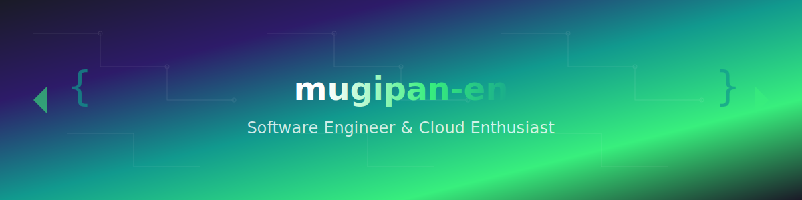

<div align="center">
  


# 👋 Hi there! I'm **mugipan-en**

### 🚀 Software Engineer & Cloud Enthusiast
*Passionate about building scalable systems and clean code*

---


[](https://github.com/mugipan-en?tab=followers)
[](https://github.com/mugipan-en?tab=repositories)

</div>

## 💼 Professional Experience

```typescript
const mugipan = {
  role: "Software Engineer",
  focus: ["Backend Development", "Cloud Infrastructure", "DevOps"],
  languages: ["Python", "Rust", "TypeScript", "Go"],
  philosophy: "Code for humans, optimize for machines",
  currentlyLearning: "Advanced cloud architectures & distributed systems"
};
```

## 🛠️ Tech Stack & Expertise

### **Languages & Frameworks**
<div align="center">


</div>

### **Cloud & Infrastructure**
<div align="center">


</div>

### **Databases & Tools**
<div align="center">


</div>

## 🎯 Learning & Interests

<div align="center">

### **Currently Studying**


### **Areas of Interest**


</div>

## 📊 GitHub Analytics

<div align="center">
  


</div>

## 🚀 Featured Projects & Templates

<div align="center">

### **Production-Ready Templates**

[](https://github.com/mugipan-en/fastapi-ddd-template)
[](https://github.com/mugipan-en/flask-ddd-template)

[](https://github.com/mugipan-en/terraform-gcp-blueprint)
[](https://github.com/mugipan-en/terraform-aws-blueprint)

[](https://github.com/mugipan-en/rust-cli-starter)
[](https://github.com/mugipan-en/dotfiles)

</div>

## 📈 Contribution Activity

<div align="center">


</div>

## 🎯 Current Focus & Goals

```yaml
2024_goals:
  architecture:
    - "Design microservices with Domain-Driven Design"
    - "Implement event-driven architectures"
    - "Master service mesh technologies"
  
  cloud_native:
    - "Advanced Kubernetes patterns & operators"
    - "Multi-cloud deployment strategies"
    - "GitOps with ArgoCD and Flux"
  
  performance:
    - "Database optimization & query tuning"
    - "Distributed systems observability"
    - "Cost optimization in cloud environments"
  
  open_source:
    - "Contribute to major open source projects"
    - "Maintain production-ready templates"
    - "Share knowledge through technical blogs"
```

## 💡 Philosophy & Principles

<div align="center">

> **"Great software is not just about writing code—it's about crafting solutions that scale, adapt, and empower teams to build amazing things."**

🔹 **Clean Architecture** • DDD • TDD • DevOps Culture  
🔹 **Infrastructure as Code** • Security by Design • Observability First  
🔹 **Continuous Learning** • Knowledge Sharing • Team Collaboration  

</div>

## 📫 Let's Connect!

<div align="center">

[](mailto:mugipan.en@example.com)
[](https://linkedin.com/in/mugipan-en)
[](https://twitter.com/mugipan_en)
[](https://qiita.com/mugipan_en)
[](https://zenn.dev/mugipan_en)

</div>

---

<div align="center">

### 💼 Interested in:
**Backend Engineering** • **Cloud Architecture** • **DevOps & Infrastructure** • **Open Source Contributions**


**⭐ If my work helps you, consider giving a star to support open source development!**

</div>